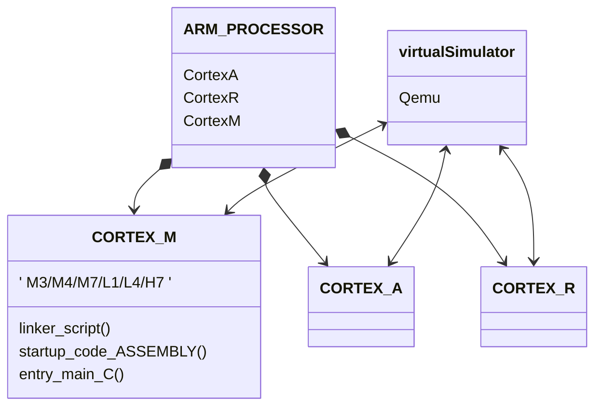

```mermaid
classDiagram
ARM_PROCESSOR : CortexA
ARM_PROCESSOR : CortexR
ARM_PROCESSOR : CortexM

virtualSimulator : Qemu

ARM_PROCESSOR *--> CORTEX_M
ARM_PROCESSOR *--> CORTEX_A
ARM_PROCESSOR *--> CORTEX_R

CORTEX_M : ' M3/M4/M7/L1/L4/H7 '
CORTEX_M : linker_script()
CORTEX_M : startup_code_ASSEMBLY()
CORTEX_M : entry_main_C()

virtualSimulator <--> CORTEX_A
virtualSimulator <--> CORTEX_R
virtualSimulator <--> CORTEX_M

```
