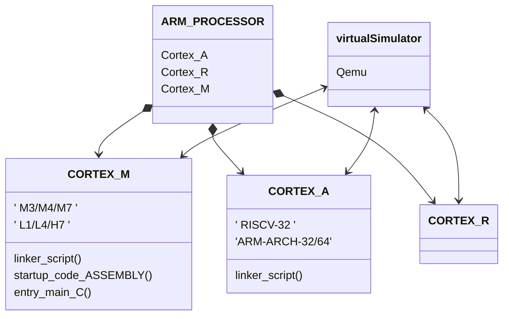

```mermaid
classDiagram
ARM_PROCESSOR : Cortex_A
ARM_PROCESSOR : Cortex_R
ARM_PROCESSOR : Cortex_M

virtualSimulator : Qemu

ARM_PROCESSOR *--> CORTEX_M
ARM_PROCESSOR *--> CORTEX_A
ARM_PROCESSOR *--> CORTEX_R

CORTEX_M : ' M3/M4/M7 '
CORTEX_M : ' L1/L4/H7 '
CORTEX_M : linker_script()
CORTEX_M : startup_code_ASSEMBLY()
CORTEX_M : entry_main_C()

CORTEX_A : ' RISCV-32 '
CORTEX_A : 'ARM-ARCH-32/64'
CORTEX_A : linker_script()

virtualSimulator <--> CORTEX_A
virtualSimulator <--> CORTEX_R
virtualSimulator <--> CORTEX_M

```
