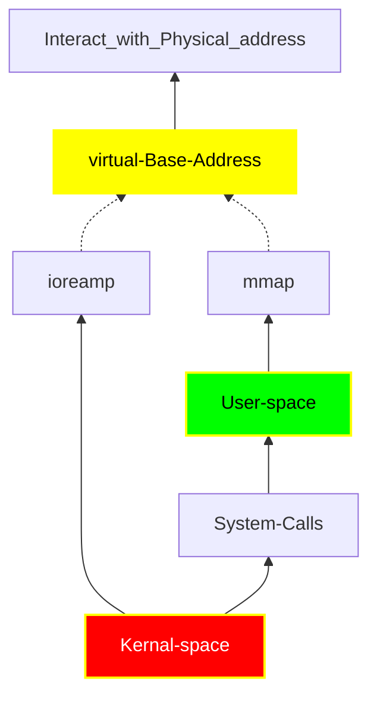

CDD = character device driver
------------------------------------------------------------------------
# [ Virtual Bus Address ] [ actual physical adress]
  not allow linux kernal to directly write to physical address (like: bare metal microcontrol low level driver we are writing.)
  - [x] Interatcing With Physical Base Address via Kernal/User Space ?
   

